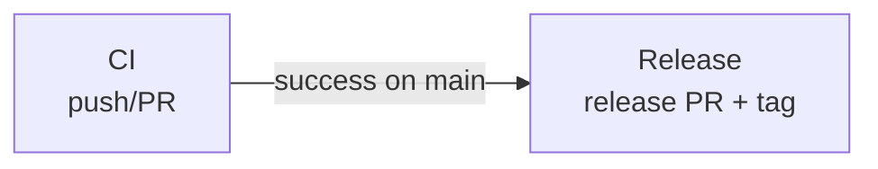

# Workflows

| Workflow    | Trigger           | Description                                                                                               |
| ----------- | ----------------- | --------------------------------------------------------------------------------------------------------- |
| **CI**      | Push to main, PRs | Runs dryrun tests in the [act-buildkit-runner](https://github.com/omniproc/act-buildkit-runner) container |
| **Release** | CI passes on main | Creates a release PR, publishes releases, and updates major version tag                                   |

## Flow

## Updating the BuildKit / Runner Version

The test workflows run inside the `act-buildkit-runner` container image. When a new version of the runner is published:

1. Update the image tag in `.github/workflows/ci.yml` (both `test-dryrun` and `test-with-cache` jobs).
2. Update the version referenced in the `README.md` Requirements section and Example usage.
3. Commit, push, and verify tests pass.
